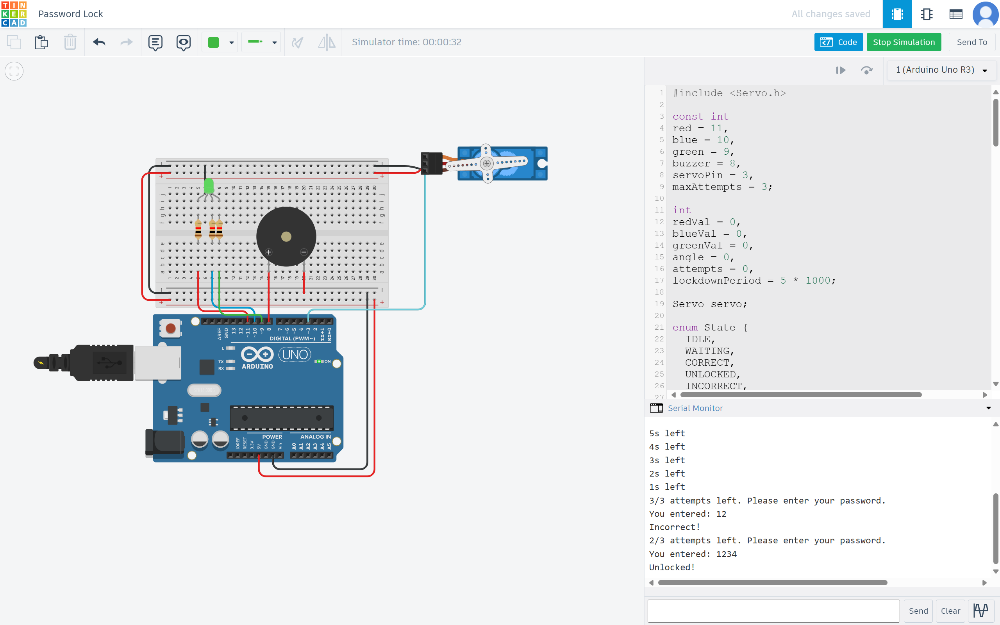

# Arduino Password Lock System



This is a basic password-protected lock system built with an **Arduino**. It uses a simple **state machine** to handle different stages of user interaction.

## Features

* Password input via **Serial Monitor**
* **RGB LED** feedback (green for success, red for lockout, yellow while waiting)
* **Buzzer** sounds during lockout
* **Servo motor** unlocks when the correct password is entered
* Locks out the user after 3 incorrect attempts, increasing the lockout time with each lock

## Components

* Arduino Uno (or compatible)
* RGB LED
* Servo Motor
* Buzzer
* Jumper wires and breadboard

## Default Password

```plaintext
1234
```
